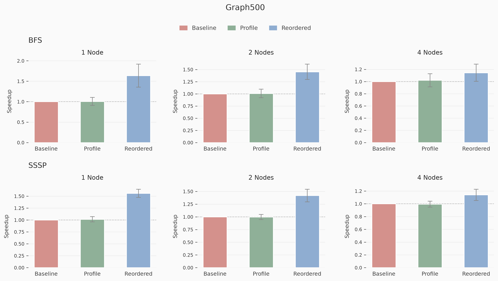

# Graph500 Benchmark

On the Hamilton cluster, profiling incurs a <1% overhead and rank-reordering improved run time by over 40% on 1 and 2 node runs.
On the ARCHER2 cluster, profiling incurs a 25% overhead and rank-reordering improved run time by over 20% on 1 and 2 node runs.

These were tested with a two-sided t-tests at the 99% significance level.

This benchmark suite runs the MPI Graph500 benchmark, testing Breadth-First Search and Single-Source Shortest Path on generated graph dataset. It is configured as a weak scaling experiment where the problem size increases with the compute resources. We ran the benchmarks on Durham's Hamilton cluster using 64 cores per node.

# Rank Reordering Performance

## Hamilton

### 1 Node

| Algorithm | Mode | Speedup | 99% CI | t-stat | p-value | Cohen's d |
| --------- | ---- | ------- | ------ | ------ | ------- | --------- |
| BFS | Automated Rank Reordering | **+62.7%** | [51.8%, 73.5%] | 15.11 | 4.49e-30 | 2.671 |
| SSSP | Automated Rank Reordering | **+53.8%** | [49.2%, 58.4%] | 30.63 | 3.15e-60 | 5.415 |

### 2 Nodes

| Algorithm | Mode | Speedup | 99% CI | t-stat | p-value | Cohen's d |
| --------- | ---- | ------- | ------ | ------ | ------- | --------- |
| BFS | Automated Rank Reordering | **+44.9%** | [37.6%, 52.1%] | 16.11 | 2.12e-32 | 2.849 |
| SSSP | Automated Rank Reordering | **+42.7%** | [36.5%, 48.9%] | 18.01 | 1.15e-36 | 3.184 |

### 4 Nodes

| Algorithm | Mode | Speedup | 99% CI | t-stat | p-value | Cohen's d |
| --------- | ---- | ------- | ------ | ------ | ------- | --------- |
| BFS | Automated Rank Reordering | **+12.3%** | [7.1%, 17.6%] | 6.13 | 1.04e-08 | 1.084 |
| SSSP | Automated Rank Reordering | **+14.8%** | [10.5%, 19.2%] | 8.95 | 3.81e-15 | 1.583 |

## Archer2, 64 cores per node

### 1 Node

| Algorithm | Mode | Speedup | 99% CI | t-stat | p-value | Cohen's d |
| --------- | ---- | ------- | ------ | ------ | ------- | --------- |
| BFS | Automated Rank Reordering | **+0.8%** | [-0.9%, 2.6%] | 1.25 | 2.14e-01 | 0.221 |
| SSSP | Automated Rank Reordering | **+13.8%** | [9.4%, 18.2%] | 8.27 | 1.65e-13 | 1.461 |

### 2 Nodes

| Algorithm | Mode | Speedup | 99% CI | t-stat | p-value | Cohen's d |
| --------- | ---- | ------- | ------ | ------ | ------- | --------- |
| BFS | Automated Rank Reordering | **+5.1%** | [3.6%, 6.5%] | 9.26 | 6.85e-16 | 1.637 |
| SSSP | Automated Rank Reordering | **+20.9%** | [16.6%, 25.1%] | 12.82 | 1.38e-24 | 2.266 |

### 4 Nodes

| Algorithm | Mode | Speedup | 99% CI | t-stat | p-value | Cohen's d |
| --------- | ---- | ------- | ------ | ------ | ------- | --------- |
| BFS | Automated Rank Reordering | **+8.0%** | [6.5%, 9.6%] | 13.65 | 1.31e-26 | 2.413 |
| SSSP | Automated Rank Reordering | **+35.8%** | [31.6%, 39.9%] | 22.46 | 6.99e-46 | 3.970 |

### 8 Nodes

| Algorithm | Mode | Speedup | 99% CI | t-stat | p-value | Cohen's d |
| --------- | ---- | ------- | ------ | ------ | ------- | --------- |
| BFS | Automated Rank Reordering | **+14.5%** | [12.8%, 16.2%] | 22.19 | 2.35e-45 | 3.923 |
| SSSP | Automated Rank Reordering | **+73.1%** | [69.2%, 77.1%] | 48.67 | 1.50e-83 | 8.603 |

## Archer2, 128 cores per node

### 1 Node

| Algorithm | Mode | Speedup | 99% CI | t-stat | p-value | Cohen's d |
| --------- | ---- | ------- | ------ | ------ | ------- | --------- |
| BFS | Automated Rank Reordering | **+7.2%** | [5.0%, 9.3%] | 8.65 | 1.99e-14 | 1.530 |
| SSSP | Automated Rank Reordering | **+20.1%** | [16.0%, 24.3%] | 12.66 | 3.29e-24 | 2.238 |

### 2 Nodes

| Algorithm | Mode | Speedup | 99% CI | t-stat | p-value | Cohen's d |
| --------- | ---- | ------- | ------ | ------ | ------- | --------- |
| BFS | Automated Rank Reordering | -3.8% | [-6.0%, -1.6%] | -4.61 | 9.58e-06 | -0.816 |
| SSSP | Automated Rank Reordering | **+27.5%** | [23.4%, 31.5%] | 17.64 | 7.64e-36 | 3.119 |

### 4 Nodes

| Algorithm | Mode | Speedup | 99% CI | t-stat | p-value | Cohen's d |
| --------- | ---- | ------- | ------ | ------ | ------- | --------- |
| BFS | Automated Rank Reordering | **+4.7%** | [2.1%, 7.2%] | 4.79 | 4.66e-06 | 0.846 |
| SSSP | Automated Rank Reordering | **+50.8%** | [47.0%, 54.5%] | 35.56 | 1.50e-67 | 6.286 |

# Profiling Overhead

## Hamilton

### 1 Node

| Algorithm | Mode | Speedup | 99% CI | t-stat | p-value | Cohen's d |
| --------- | ---- | ------- | ------ | ------ | ------- | --------- |
| BFS | Profile Run | +0.0% | [-8.5%, 8.6%] | 0.01 | 9.96e-01 | 0.001 |
| SSSP | Profile Run | +1.2% | [-2.1%, 4.6%] | 0.95 | 3.43e-01 | 0.168 |

### 2 Nodes

| Algorithm | Mode | Speedup | 99% CI | t-stat | p-value | Cohen's d |
| --------- | ---- | ------- | ------ | ------ | ------- | --------- |
| BFS | Profile Run | +0.3% | [-6.0%, 6.5%] | 0.11 | 9.13e-01 | 0.019 |
| SSSP | Profile Run | -0.5% | [-6.1%, 5.0%] | -0.26 | 7.98e-01 | -0.045 |

### 4 Nodes

| Algorithm | Mode | Speedup | 99% CI | t-stat | p-value | Cohen's d |
| --------- | ---- | ------- | ------ | ------ | ------- | --------- |
| BFS | Profile Run | +1.5% | [-4.2%, 7.2%] | 0.69 | 4.91e-01 | 0.122 |
| SSSP | Profile Run | -0.7% | [-5.4%, 4.0%] | -0.40 | 6.90e-01 | -0.071 |

## Archer2, 64 cores per node

### 1 Node

| Algorithm | Mode | Speedup | 99% CI | t-stat | p-value | Cohen's d |
| --------- | ---- | ------- | ------ | ------ | ------- | --------- |
| BFS | Profile Run | -0.6% | [-2.2%, 1.0%] | -0.97 | 3.32e-01 | -0.172 |
| SSSP | Profile Run | -11.8% | [-15.7%, -8.0%] | -8.01 | 6.73e-13 | -1.415 |

### 2 Nodes

| Algorithm | Mode | Speedup | 99% CI | t-stat | p-value | Cohen's d |
| --------- | ---- | ------- | ------ | ------ | ------- | --------- |
| BFS | Profile Run | -4.6% | [-5.8%, -3.5%] | -10.37 | 1.32e-18 | -1.834 |
| SSSP | Profile Run | -16.8% | [-20.3%, -13.3%] | -12.50 | 8.34e-24 | -2.209 |

### 4 Nodes

| Algorithm | Mode | Speedup | 99% CI | t-stat | p-value | Cohen's d |
| --------- | ---- | ------- | ------ | ------ | ------- | --------- |
| BFS | Profile Run | -7.5% | [-8.9%, -6.2%] | -14.55 | 9.63e-29 | -2.572 |
| SSSP | Profile Run | -26.4% | [-29.4%, -23.3%] | -22.33 | 1.24e-45 | -3.948 |

### 8 Nodes

| Algorithm | Mode | Speedup | 99% CI | t-stat | p-value | Cohen's d |
| --------- | ---- | ------- | ------ | ------ | ------- | --------- |
| BFS | Profile Run | -10.3% | [-11.7%, -8.9%] | -19.03 | 7.32e-39 | -3.364 |
| SSSP | Profile Run | -41.2% | [-43.5%, -39.0%] | -47.99 | 7.97e-83 | -8.484 |

## Archer2, 128 cores per node

### 1 Node

| Algorithm | Mode | Speedup | 99% CI | t-stat | p-value | Cohen's d |
| --------- | ---- | ------- | ------ | ------ | ------- | --------- |
| BFS | Profile Run | -2.9% | [-5.1%, -0.8%] | -3.54 | 5.62e-04 | -0.626 |
| SSSP | Profile Run | -18.0% | [-21.4%, -14.5%] | -13.74 | 8.23e-27 | -2.428 |

### 2 Nodes

| Algorithm | Mode | Speedup | 99% CI | t-stat | p-value | Cohen's d |
| --------- | ---- | ------- | ------ | ------ | ------- | --------- |
| BFS | Profile Run | -5.7% | [-7.6%, -3.9%] | -8.16 | 2.96e-13 | -1.442 |
| SSSP | Profile Run | -25.5% | [-28.6%, -22.4%] | -21.37 | 1.03e-43 | -3.777 |

### 4 Nodes

| Algorithm | Mode | Speedup | 99% CI | t-stat | p-value | Cohen's d |
| --------- | ---- | ------- | ------ | ------ | ------- | --------- |
| BFS | Profile Run | -9.8% | [-11.9%, -7.6%] | -11.88 | 2.62e-22 | -2.101 |
| SSSP | Profile Run | -39.2% | [-41.6%, -36.9%] | -43.59 | 7.37e-78 | -7.706 |
